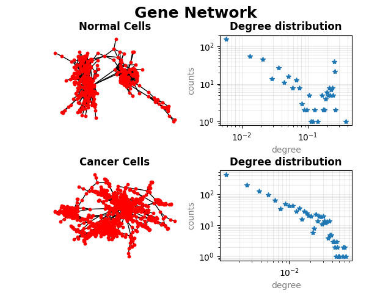

## Authors
***
  Hossein Eizadi.M, Hadi Eidgah, Dario Dedja, Harshith Hemanth</br>
  
#### Final project of Modeling and simulations</br>
Professor Lorenzo Farina</br>
Sapienza University of Rome</br>

## Requirements
***
For this Analysis you need the following libraries already installed:</br>
R Packages dplyr, tidyr, igraph and Python libraries networkx, numpy, matplotlib.

***


### Import the data related to the Breast Cancer
```{r label= "Import", fig.width=6, fig.height=6, fig.align='center', warning=FALSE, message=FALSE}
Dataset <- "brca"
AllData <- read.delim(paste0("Matrici_TCGA_2014/", Dataset,"/", Dataset, "_RNASeq/matrice__", Dataset, "_RNASeq.txt"),header = TRUE)

# list of patients (barcode)
patswID <- colnames(AllData)
pats <- patswID[2:length(patswID)]  # Remove "ID" item

gene <- AllData[,1] # List of genes (symbol|entrez ID), some symbols are missing

RNAseqData <- AllData[,2:length(patswID)]   # Separate gene symbol from ID


# Separate gene symbol from ID
library(dplyr)
library(tidyr)

framed <- data.frame(gene) # make a data frame to be used for separation
Separated <- framed %>% separate(gene, c("symbols","ID") ,"[|]") # separate them into two columns
geneS = Separated[1][,1] # Extract Symbols
geneI = Separated[2][,1] # Extract IDs
```


### Import Normal and Cancer patients data and Analysis
```{r label="Calculations", fig.width=6, fig.height=6, fig.align='center', warning= FALSE}
# Import the 4way data of Normal Cells into R
listPN <- readLines(paste0("Matrici_TCGA_2014/", Dataset,"/Patients_with_4wayData/Lista__RNASeq_Normal__", Dataset, "__4wayData.txt"))

# Import the 4way data of Cancer Cells into R
listPC <- readLines(paste0("Matrici_TCGA_2014/", Dataset,"/Patients_with_4wayData/Lista__RNASeq_Tumor__", Dataset, "__4wayData.txt"))

# Correct a problem (different use of "." and "-")
listPC <- gsub("-",".",listPC)
listPN <- gsub("-",".",listPN)

# Separate Normal and Cancer data

DataN <- AllData[,listPN]
DataC <- AllData[,listPC]

# log2 Fold change data matrix
FC <- log2(DataC/ DataN)

# Transform all non numeric data to NA to be used in rowMeans
FCnumbers <- FC
FCnumbers[FCnumbers=="NaN"] <- NA
FCnumbers[FCnumbers=="Inf"] <- NA
FCnumbers[FCnumbers=="-Inf"] <- NA

mFC <- rowMeans(FCnumbers) # mean log2 FC data matrix


# treat zeros as missing values (NA)
DataN[DataN==0] <- NA
DataC[DataC==0] <- NA

# Normalize to unimodal
dataNlg <- log10(DataN)
dataClg <- log10(DataC)


# Performe t-test to get P values
Pvalues <- sapply(1:nrow(dataNlg),function(x) {
        a = na.omit(as.numeric(dataNlg[x,])) # Discard rows with NA values to avoid errors in t-test
        b = na.omit(as.numeric(dataClg[x,])) # Discard rows with NA values to avoid errors in t-test
        if(length(a) > 1 && length(b) > 1) { # Discard rows with one or zero values
                  t.test(dataNlg[x,],dataClg[x,])$p.value} else{"NA"}
               }
          )

# compute BH false discovery rate and Q values
Qvalues <- p.adjust(Pvalues, "BH")

# Volcano plot
plot(mFC, -log10(Qvalues), pch=19, cex = 0.5, xlab = "mean log_2 fold change", ylab ="-log_{10} Q value", 
    col = 'blue',  title(Dataset), panel.first = grid(), xlim = c(-8, 8))
```


### Select the best M (using Q values only)
```{r label="Selection", fig.width=6, fig.height=6, fig.align='center', warning= FALSE}
ind <- order(Qvalues)  # Get a list of indexes in the ordered form

# We look amoung the first 5000 genes with the lowest Q-value so stronger evidence of the gene
M <- 5000

geneSb=geneS[ind[1:M]]
geneIb=geneI[ind[1:M]] 
dataNb=(DataN[ind[1:M],])
dataCb=(DataC[ind[1:M],])
```


### Correlation network
```{r label= "Correlation", fig.width=6, fig.height=6, fig.align='center', warning= FALSE, message = FALSE}
# Calculate the correlation between genes
corrN = cor(t(dataNb), use = "pairwise.complete.obs")
corrC = cor(t(dataCb), use = "pairwise.complete.obs")

# We only need the maximum correlations so we separate data over 99.9% percentile
subcorrN = corrN > quantile(corrN, 0.999, na.rm = TRUE)
subcorrC = corrC > quantile(corrC, 0.999, na.rm = TRUE)

# Convert to 0 and 1 to be used in Python
subcorrN[subcorrN == "TRUE"] <- 1
subcorrN[subcorrN == "FALSE"] <- 0
subcorrC[subcorrC == "TRUE"] <- 1
subcorrC[subcorrC == "FALSE"] <- 0

# Save the extracted data to be used in Python for Network analysis
write.csv(subcorrN, file = "scorrN.csv", row.names = FALSE)
write.csv(subcorrC, file = "scorrC.csv", row.names = FALSE)
```


### Network analysis using Networkx in Python
```{python, engine.path = '/usr/bin/python3', python.reticulate = FALSE, label="Python", warning= FALSE, message = FALSE}
# Import the required libraries
import networkx as nx
import numpy as np
import matplotlib.pyplot as plt


# Import saved Normal cells data into Python
CorrN = np.genfromtxt("scorrN.csv",delimiter = ',')[1:]

# Convert it to a graph
GN = nx.from_numpy_matrix(CorrN)
GN.remove_edges_from(GN.selfloop_edges()) # Remove selfloops for simplicity reasons

# Import saved Cancer cells data into Python
CorrC = np.genfromtxt("scorrC.csv",delimiter = ',')[1:]

# Convert it to a graph
GC = nx.from_numpy_matrix(CorrC)
GC.remove_edges_from(GC.selfloop_edges()) # Remove selfloops for simplicity reasons


# Extracting the biggest connected component of the main graph
SGN = sorted(nx.connected_component_subgraphs(GN), key=len, reverse=True)[0]
SGC = sorted(nx.connected_component_subgraphs(GC), key=len, reverse=True)[0]

# Calculating the degree of centrality of the greatest connected component
deg_ranks_SN = nx.degree_centrality(SGN)
deg_ranks_SC = nx.degree_centrality(SGC)

# Calculating the counts of each degree using histogram functions
HistInfoN = np.histogram(list(deg_ranks_SN.values()), bins =50)
HistInfoC = np.histogram(list(deg_ranks_SC.values()), bins =50)

# Ploting Networks and degree distributaion of normal and cancer cells all together for comparison
fig = plt.figure()
fig.suptitle("Gene Network", fontsize=18 , fontweight='bold')

# Drawing the network of the Normal cells
ax11 = plt.subplot(221)
posN = nx.spring_layout(SGN) # using spring layout
nx.draw(SGN, pos = posN, node_size = 10, node_color='red')
plt.title("Normal Cells", fontweight='bold')

# Drawing the network of the Cancer cells
ax12 = plt.subplot(223)
posC = nx.spring_layout(SGC) # using spring layout
nx.draw(SGC, pos = posC, node_size = 10, node_color='red')
plt.title("Cancer Cells", fontweight='bold')

# Drawing degree distributaion of Normal cells
ax21 = plt.subplot(222)
plt.loglog((HistInfoN[1][:-1]+HistInfoN[1][1:])/2,HistInfoN[0], "*") # Averaging two sides of each bin
plt.grid(True, which="both", alpha = 0.25)
plt.xlabel('degree', alpha = 0.5)
plt.ylabel('counts', alpha = 0.5)
plt.title("Degree distribution", fontweight='bold')

# Drawing degree distributaion of Cancer cells
ax22 = plt.subplot(224)
plt.loglog((HistInfoC[1][:-1]+HistInfoC[1][1:])/2,HistInfoC[0], "*") # Averaging two sides of each bin
plt.grid(True, which="both", alpha = 0.25)
plt.xlabel('degree', alpha = 0.5)
plt.ylabel('counts', alpha = 0.5)
plt.title("Degree distribution", fontweight='bold')

plt.subplots_adjust(hspace=0.5, wspace=0.3)
plt.savefig("Gene_Network.png")
plt.close()

# Calculating the degree of centrality of all the genes and ploting it
deg_ranks_N = nx.degree_centrality(GN)
deg_ranks_C = nx.degree_centrality(GC)

plt.scatter(deg_ranks_N.values(), deg_ranks_C.values(), marker = "+")
plt.xlabel('degree (normal)', fontweight='bold')
plt.ylabel('degree (cancer)', fontweight='bold')
plt.savefig("degree.png") 
plt.close()
```


## Result
***

<center></center><br/>
<center></center>


# Software
***

We have used the following versions:

### Linux
Hossein-HP-EliteBook-840-G1 5.3.0-45-generic #37~18.04.1-Ubuntu SMP x86_64 x86_64 x86_64 GNU/Linux

### R
R version 3.6.3 (2020-02-29) -- "Holding the Windsock"<br/>
Copyright (C) 2020 The R Foundation for Statistical Computing<br/>
Platform: x86_64-pc-linux-gnu (64-bit)<br/>
dplyr  0.8.4,<br/> 
tidyr  1.0.2, <br/>
igraph  1.2.4.2<br/>

### Python3
Python 3.6.9<br/>
networkx  2.4,<br/>
numpy  1.18.1,<br/>
matplotlib  3.2.0<br/>
